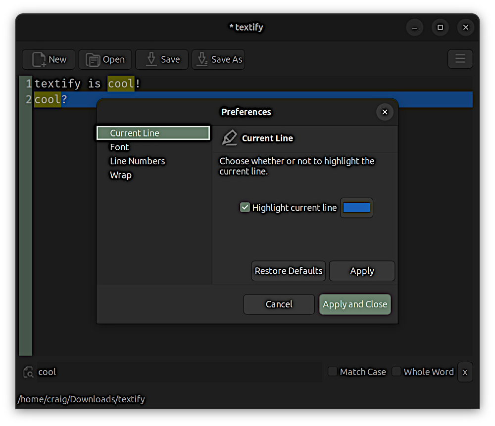

# textify
A minimal text editor for Gnome.

 

# Installation
Download the latest `ca.footeware.swt.textify-#.#.#-SNAPSHOT.zip` file from the **Releases** page and extract it to a convenient folder. There should be an `install-files` folder and an `INSTALL` file. 

In nautilus, right-click the `INSTALL` file and select  _Run as a Program_ , or at command prompt, enter `./INSTALL`. In both cases, you will be presented with a description of the steps being taken to install **textify**. When done, **textify**  should be ready to run via command prompt or via the **textify**  launcher. If it does not work, log off and log in again and it should (path issue?). If it still doesn't work, please file a ticket on this site's  _Issues_  tab. Once installed the zip file and its extracted files can safely be deleted. 

At the command prompt, **textify**  can be used to open a file with name as argument (`textify filename`). 

In nautilus, **textify** can open several text-based file types via the  _Open With..._  menu item as it appears in the list of alternate applications. Further, it can be associated with that file type by enabling the  _Always use for this file type_  slider.

# Features

* Plain text editing
* Font selection as a preference
* Line number column as a preference
* Line wrapping as a preference
* Highlight current line and color as a preference
* Search via Ctrl+F
* Key bindings viewable from hamburger menu
* Cut, Copy and Paste popup menu items and their shortcuts
* Follows Gnome theme and highlight color

# Installation Details

The installation will:
1. remove the previous install (if it exists)
2. create install folders `$HOME/.local/bin/` and `$HOME/.local/share/textify/`
3. add `$HOME/.local/bin` to `$PATH`
4. copy the jar to `$HOME/.local/share/textify/`
5. copy the icon to `HOME/.local/share/textify/`
6. make the launcher executable and copy it to `$HOME/.local/bin/`
7. copy `.desktop` file to `$HOME/.local/share/applications/`

That's it, done. Everything installed into your home folder so there is no need for `sudo`.
A rolling log file is located in `$HOME/.local/share/textify/logs/`. They are gzipped and deleted as they age off.

# The Code

**textify**  is written entirely in Java, producing a .jar file with a `MANIFEST.MF` specifying the main class. Thus, the jar can be run at the command prompt as `java -jar ca.footeware.swt.textify-#.#.#-SNAPSHOT.jar`. This is what the included launcher bash script does. There's also a `.desktop` file so the launcher shows up in the Gnome applications list and uses the provided icon. The launcher is copied into the `$HOME/.local/bin/` folder which is then added to `$PATH` so it can be used at the command prompt.

To get around the limitation of not being able to use environment variables like `$HOME` in `.desktop` files, `sed` was used to resolve the user home location and enter it into the `.desktop` file upon copying.

The project is built using maven which builds the jar as a fat jar, including all its dependencies:
* SWT
* JFace
* [Open](https://github.com/vaadin/open "Open") (opens web pages)
* Log4J

It also copies the jar and other resources into the resulting zip file. The project can be built using `mvn clean install` though eclipse may make it easier.

The releases to date have targeted Gnome. The Java code is platform-independent but the SWT widget library, `org.eclipse.swt.gtk.linux.x86_64`, is specific to the linux OS on x86_64 platform. SWT also publishes a windows libary that theoretically could produce a build for that OS too. Perhaps a future version :smirk:.

# Disclaimer

**textify**  is freely available under the [GPL3](https://www.gnu.org/licenses/gpl-3.0.en.html "GPL3")  license and is presented  _as is_  with no liability. Its code is open-source and open to pull requests and issues from anyone.
